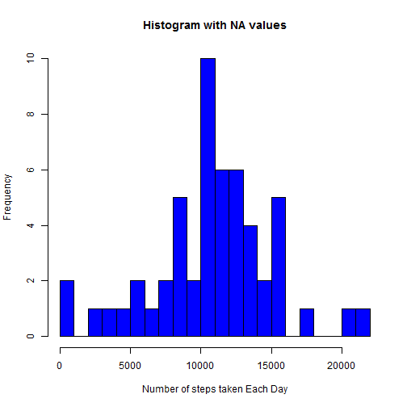
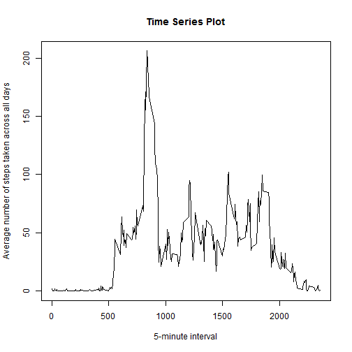
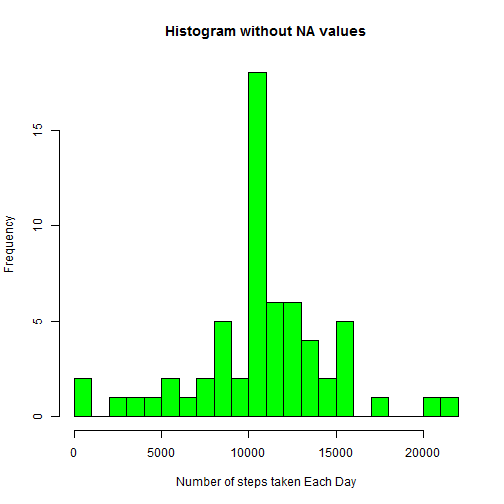
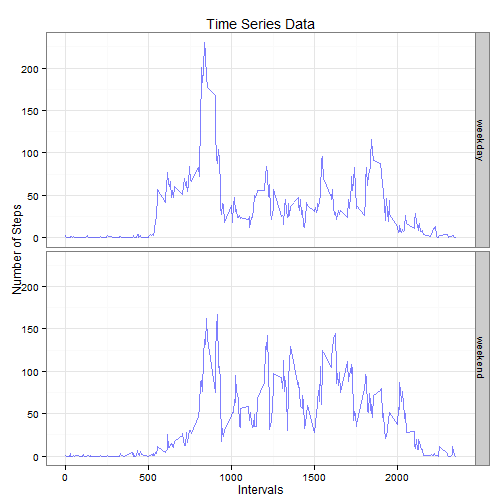
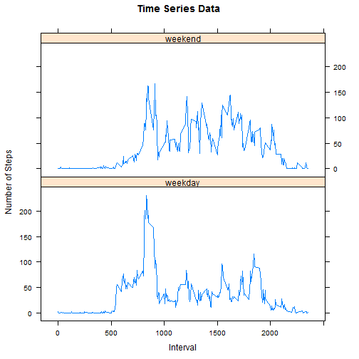

Context of the Markdown
=========================

This assignment will be described in multiple parts. You will need to write a report that answers the questions detailed below. Ultimately, you will need to complete the entire assignment in a single R markdown document that can be processed by knitr and be transformed into an HTML file.

Loading and Processing Data
----------------------------


```r
actual_activity_dataset <- read.csv(file = "activity.csv")
activity_dataset <- actual_activity_dataset
activity_dataset$steps <- as.numeric(as.character(activity_dataset$steps))
activity_dataset$date <- as.Date(activity_dataset$date, format="%m/%d/%Y")
activity_dataset$interval <- as.numeric(as.character(activity_dataset$interval))
```


Now we shall calculate the mean total number of steps taken per day
--------------------------------------------------------------------


```r
tidy_activity_dataset_sum <- aggregate(activity_dataset$steps, by=list(activity_dataset$date), "sum")
tidy_activity_dataset_mean <- aggregate(activity_dataset$steps, by=list(activity_dataset$date), "mean")
tidy_activity_dataset <- cbind(tidy_activity_dataset_sum,tidy_activity_dataset_mean$x)
names(tidy_activity_dataset) <- c("Date","Sum","Mean")
```

1. Make a histogram of the total number of steps taken each day

```r
hist(tidy_activity_dataset$Sum,breaks = 30, xlab = "Number of steps taken Each Day", col = "blue", main = "Histogram with NA values")
```

 

2.Calculate and report the mean and median total number of steps taken per day

```r
org_mean <- mean(tidy_activity_dataset_sum$x,na.rm = T)
org_median <- median(tidy_activity_dataset_sum$x,na.rm = T)
org_mean
```

```
## [1] 10766.19
```

```r
org_median
```

```
## [1] 10765
```

The mean is 1.0766189 &times; 10<sup>4</sup> and the median is 1.0765 &times; 10<sup>4</sup>

Now we shall calculate the average daily activity pattern
---------------------------------------------------------


```r
tidy_timeseries_dataset <- aggregate(activity_dataset$steps, by=list(activity_dataset$interval), "mean", na.rm = T)
```

1.Make a time series plot (i.e. type = "l") of the 5-minute interval (x-axis) and the average number of steps taken, averaged across all days (y-axis)

```r
plot(tidy_timeseries_dataset,type="l", xlab = "5-minute interval", ylab = "Average number of steps taken across all days", main= "Time Series Plot")
```

 

2. Which 5-minute interval, on average across all the days in the dataset, contains the maximum number of steps?

```r
tidy_timeseries_dataset_sum <- aggregate(activity_dataset$steps, by=list(activity_dataset$interval), "sum", na.rm = T)
tidy_timeseries_dataset <- cbind(tidy_timeseries_dataset,tidy_timeseries_dataset_sum$x)
names(tidy_timeseries_dataset) <- c("Interval","Mean","Sum")
max_steps <- tidy_timeseries_dataset[which.max(tidy_timeseries_dataset$Sum),]$Interval
```

The maximum number of steps taken is 835

Imputing missing values
------------------------------
Note that there are a number of days/intervals where there are missing values (coded as NA). The presence of missing days may introduce bias into some calculations or summaries of the data.

1. Calculate and report the total number of missing values in the dataset (i.e. the total number of rows with NAs)

```r
table(is.na(activity_dataset$steps))
```

```
## 
## FALSE  TRUE 
## 15264  2304
```

2. Devise a strategy for filling in all of the missing values in the dataset. The strategy does not need to be sophisticated. 

The strategy that has been devised is to fill in the NA values we have taken the mean of that particular interval

```r
fresh_tidy_activity_dataset <- activity_dataset
for(i in 1:nrow(fresh_tidy_activity_dataset))
  {
    if (is.na(fresh_tidy_activity_dataset[i,]$steps))
    {      
       for(j in 1:nrow(tidy_timeseries_dataset))
      {
        if(fresh_tidy_activity_dataset[i,]$interval == tidy_timeseries_dataset[j,]$Interval)
             fresh_tidy_activity_dataset[i,]$steps <- tidy_timeseries_dataset[j,]$Mean
      }
         
    }
  }
```

Verifying whether the NA values have been replaced

```r
table(is.na(fresh_tidy_activity_dataset$steps))
```

```
## 
## FALSE 
## 17568
```

Make a histogram of the total number of steps taken each day

```r
fresh_tidy_activity_dataset_sum <- aggregate(fresh_tidy_activity_dataset$steps, by=list(fresh_tidy_activity_dataset$date), "sum")
hist(fresh_tidy_activity_dataset_sum$x,breaks = 30, xlab = "Number of steps taken Each Day", col = "green", main = "Histogram without NA values")
```

 
Calculate and report the mean and median total number of steps taken per day

```r
fin_mean <- mean(fresh_tidy_activity_dataset_sum$x)
fin_median <- median(fresh_tidy_activity_dataset_sum$x,na.rm = T)
```
Do these values differ from the estimates from the first part of the assignment?

```r
rbind(org_mean - fin_mean, org_median - fin_median)
```

```
##           [,1]
## [1,]  0.000000
## [2,] -1.188679
```

What is the impact of imputing missing data on the estimates of the total daily number of steps?
The mean is the same but there is a deviation in median by 1.1886792

Are there differences in activity patterns between weekdays and weekends?


```r
fresh_tidy_activity_dataset$day <- weekdays(fresh_tidy_activity_dataset$date)
fresh_tidy_activity_dataset$day <- gsub("Monday|Tuesday|Wednesday|Thursday|Friday", "weekday",fresh_tidy_activity_dataset$day)
fresh_tidy_activity_dataset$day <- gsub("Sunday|Saturday", "weekend",fresh_tidy_activity_dataset$day)
fresh_tidy_activity_dataset$day <- factor(fresh_tidy_activity_dataset$day)
fresh_final__tidy_activity_dataset <- aggregate(steps ~ interval + day, data = fresh_tidy_activity_dataset, mean)
```

Using ggplot Plot


```r
library(ggplot2)
```

```
## Use suppressPackageStartupMessages to eliminate package startup messages.
```

```r
g <- ggplot(fresh_final__tidy_activity_dataset, aes(interval,steps))
g + labs(title = "Time Series Data", x = "Intervals", y = "Number of Steps") + facet_grid(day~.) + geom_line(color = "blue", alpha = 1/2) + theme_bw(base_family = "Times")
```

 

Using Lattice Plot


```r
library(lattice)
xyplot(steps ~ interval | day,data = fresh_final__tidy_activity_dataset, type = "l", layout = c(1,2), xlab = "Interval" , ylab = "Number of Steps", main = "Time Series Data")
```

 
